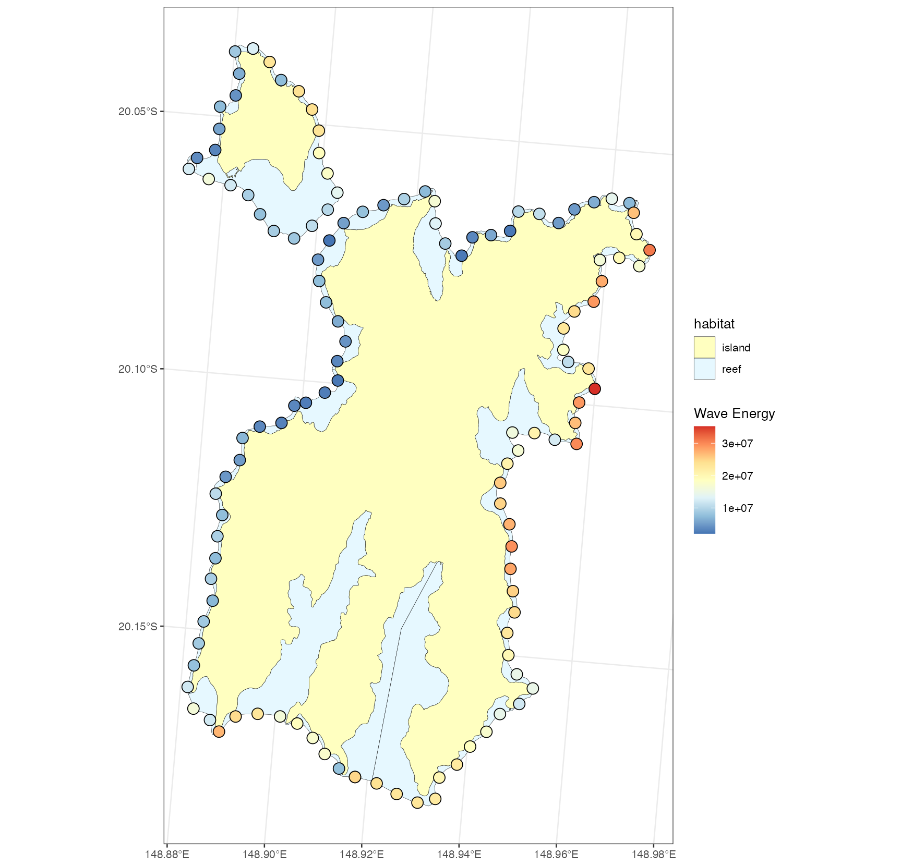

# oceanwaves  
oceanwaves is a **development** R package designed for simulating wave exposure and wind fetch along complex coastlines. It provides tools to compute directional fetch, model wave energy based on wind speed and duration, and visualize exposure patterns across marine landscapes. Built with compatibility for spatial workflows (`sf`, `terra`) and marine applications, it enables ecologists and oceanographers to estimate fine-scale hydrodynamic forcing for reefs, islands, and coastal habitats using simple, reproducible methods.

# 
